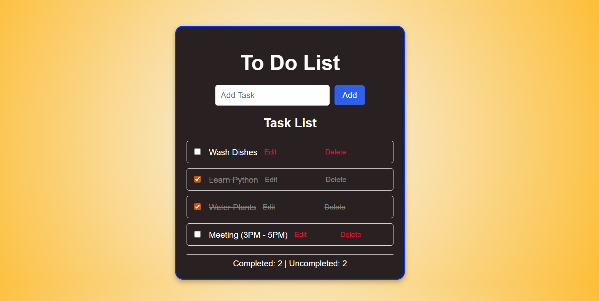

# To-Do List Web App

A simple and interactive To-Do List application built with **HTML, CSS, and JavaScript**.  
This project allows users to add, mark as completed, and delete tasks with a clean UI.  

---

##  Features
-  Add new tasks  
-  Mark tasks as completed (with strikethrough)  
-  Delete tasks  
-  Task counter (completed vs uncompleted)  
    
---

## Screenshots

### Main UI

---

##  Technologies Used
- **HTML5** – structure  
- **CSS3** – styling  
- **JavaScript (ES6)** – interactivity  

---
